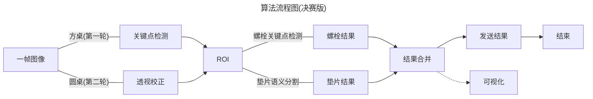

```mermaid
---
title: 算法流程图(决赛版)
---

flowchart LR

一帧图像 --方桌(第一轮)--- 关键点检测 --> ROI
一帧图像 --圆桌(第二轮)--- 透视校正 --> ROI

ROI --螺栓关键点检测--- 螺栓结果 --> 结果合并
ROI --垫片语义分割--- 垫片结果 --> 结果合并

结果合并 --> 发送结果 --> 结束
结果合并 -.-> 可视化
```

