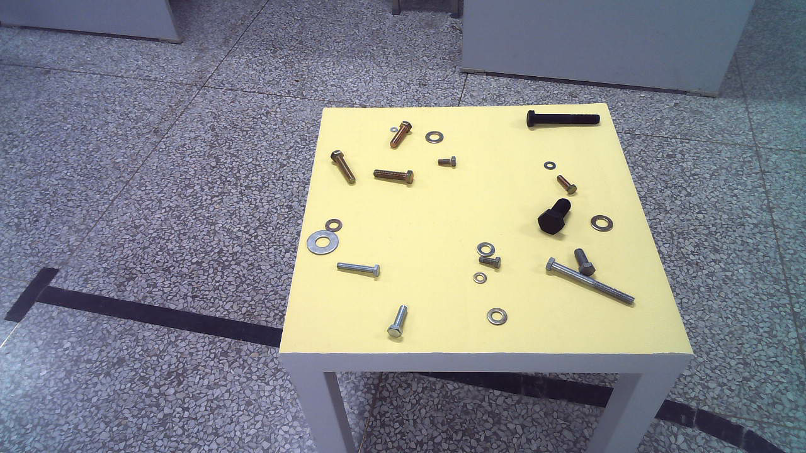
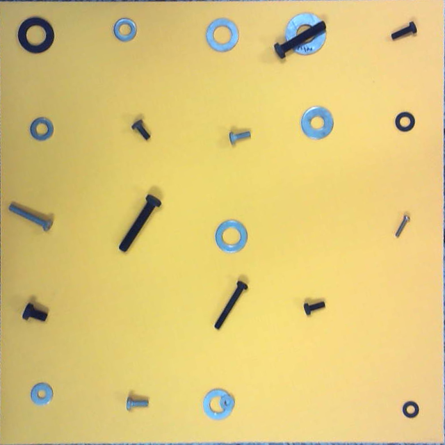
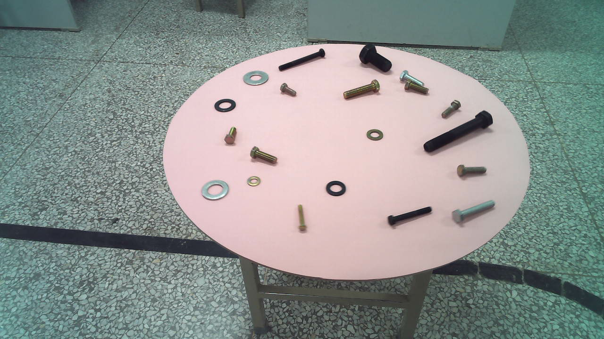

# 手册
这里是本仓库完整的实现思路与技术细节，分四个部分。查阅之前请确保你已看过2025年工业测量专项赛和总决赛的比赛规则。

## 1.硬件配置
感谢张驰老师出资为我们团队购买香橙派与相机，因此两者属于组内资产，如果你在张驰老师组里，可以直接向老师借来；如果只是robocup社团的学生，社团内有两套设备可供使用

### 相机
今年使用相机为奥比中光astra pro plus，相机配置见本目录下相机配置文件

### 香橙派
orange pi AI Pro， 网上可以搜到说明书，我们也在百度网盘提供购买香橙派时的资料

## 2.思路
总体来讲，决赛只比专项赛多了一个圆桌，专项赛两轮和总决赛第一轮都是方桌，我们方桌已经做的足够好了，可以重点优化圆桌

### 方桌

对于方桌，我们在图像中可以很明显的看到方桌的边缘，因此直接用一个yolov8-pose提取方桌的四个关键点，通过透视变换将其拉伸为一个(640, 640)大小的图像

在此基础上分别检测螺栓和垫片， 其中螺栓使用关键点检测模型检测出四个关键点lt, rt, rb, lb， 垫片使用语义分割检测外环和内环， 

螺栓直径的像素距离即为rb - lb， 长度为lr,rt中点, rb,lb中点之间距离。

### 圆桌

圆桌我们使用一个yolov5语义分割模型检测圆桌掩码，在通过cv2.ellipse找到椭圆的旋转矩形。(接下来是重点)

我们一开始是直接用椭圆外接矩形的四个顶点去做透视变换(见`for_ellipse.py`),

在此基础上和方桌一样检测螺栓和垫片(这张图随便找的，只是为了测试提取圆桌，没有放零件)，但是我们在赛前发现这样做不管螺栓的关键点测得如何准确，最后结果都非常不好，由此引出一个问题：

- 圆从侧面看是一个椭圆，但是这个椭圆的中心就是圆的中心吗？

这个视频给了我们启发：

我们不妨在回顾一下方桌：一个正方形，从侧面看是一个梯形，靠近我们的边长会比远离我们的边长长，所以圆应该也是这样的，如果我们不考虑透视带来的畸变，我们就不可能拉伸出原本的圆形。

所以椭圆的中心并不是圆形的圆心，椭圆的长轴端点也不是原来圆直径上的两点，但是椭圆的短端端点是的。

因此我们的任务就变成了找到原来圆的圆心映射在椭圆上的位置，我们查阅了一些文献，找到了一篇讲中心偏移的:`Analysis for center deviation of circular target under perspective projection`，但是因为涉及到要找相机偏移角度，我们最后没有时间做。

我们假设是在椭圆短轴上的，拟合之后做平行线与椭圆交于两点，之后用四点去拉伸得到，但是目前效果不是很好，可在这个方向上继续拟合，也可找更精确的解。
